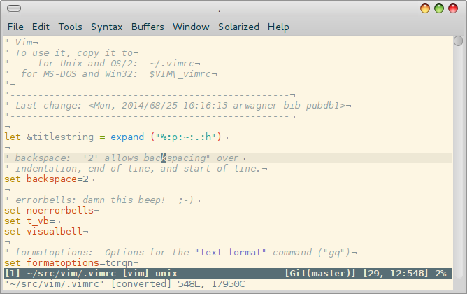

# vim

These are just setup files mapping my personal preferences. They use a
bunch of vim scripts from other sources, sometimes slightly adopted,
sometimes as is. A bunch of them are homebrewn over the years. Though
everyone can use this stuff it might be absolutely useless to everyone
exept myself. But having it in a public repo makes cloning of
installation so much easier ;)

## Installation

Just clone and copy.

## FAQ

### Unused scripts

Some scripts were considered useful in the past but are not sourced
automatically.

### External sources
Many scripts are from external authors, so this is more a collection
of vim scripts in the way used personally. Please refer to the scripts
to check out their original author and probably source of the latest
version. Not all scripts are kept up to date regularly. Currently,
the use of pathogene or the like is not implemented.

### Dictionaries
This setup contains several dictionaries built from LibreOffice
sources. (cf. .vim/spell/). For German and English both utf-8 and
latin1 version of the dicts are kept, for english even an ASCII
version. Besides these common dicts the setup contains also a
dictionary for Gaelic encoded in utf-8 only.
