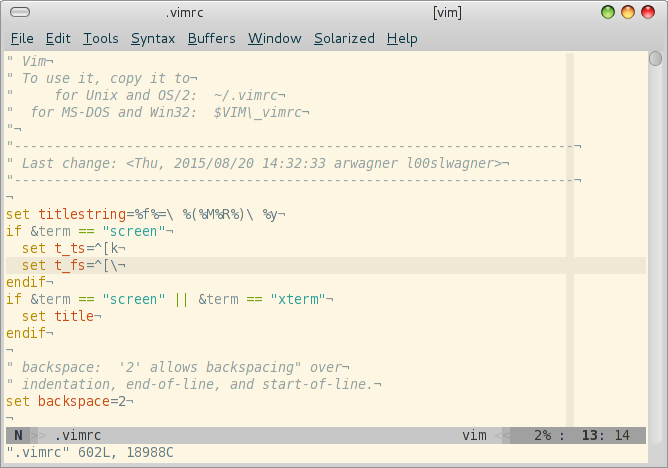

# vim

These are just setup files mapping my personal preferences. They use a bunch of
vim scripts from other sources, sometimes slightly adopted, sometimes as is. A
bunch of them are homebrewn over the years. Though everyone can use this stuff
it might be absolutely useless to everyone exept myself. But having it in a
public repo makes cloning of installation so much easier ;)

## Installation

Just clone and copy.

## FAQ

### Unused scripts

Some scripts were considered useful in the past but are not sourced
automatically.

### External sources

Most of the larger scripts are form other authors. To handle them cleanly
[pathogen](https://github.com/tpope/vim-pathogen) is used. These scripts live in
`.vim/bundle` subdir. Upon cloning this repository those subdirs will be empty
as they are handled by `git` as `submodules`. To populate them use

    git submodule init
    git submodule update

which will fetch the current code from the repositories of the projects in
question.

Run

    git submodule foreach git pull origin master

to update all submodules in one go to head of their respective master.

Also quite a bunch of the smaller scripts are form other authors or include
contributions form others. Please refer to the scripts to check out their
original author and probably source of the latest version. Not all scripts are
kept up to date regularly.

### Dictionaries

This setup contains several dictionaries built from LibreOffice sources. (cf.
.vim/spell/). For German and English both utf-8 and latin1 version of the dicts
are kept, for english even an ASCII version. Besides these common dicts the
setup contains also a dictionary for Gaelic encoded in utf-8 only.
